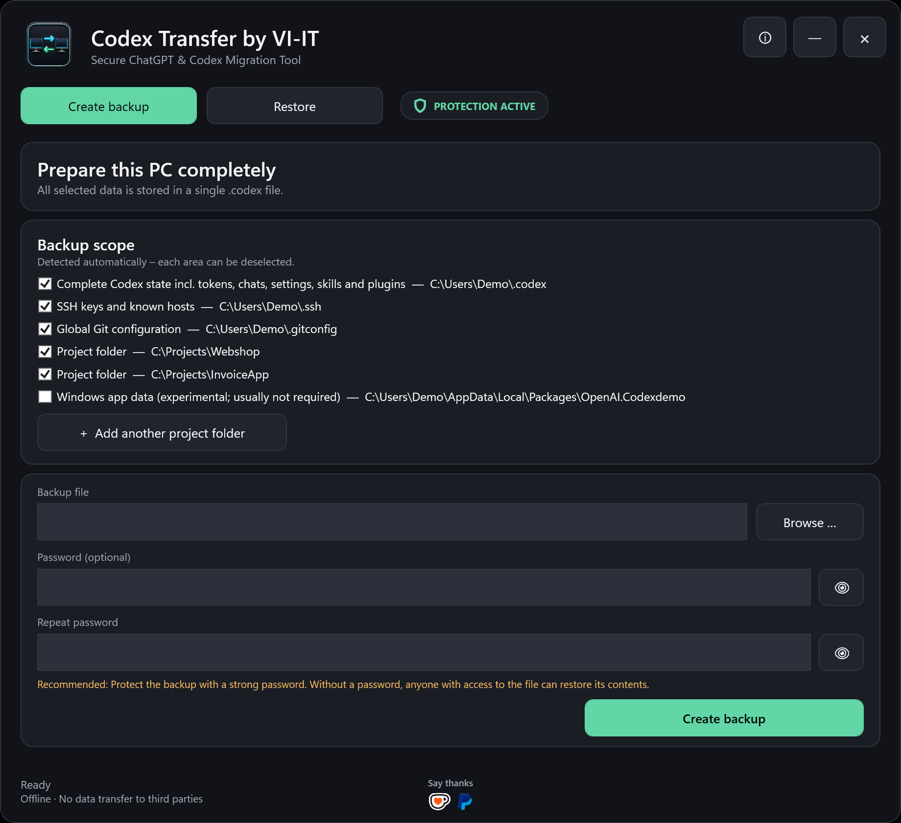
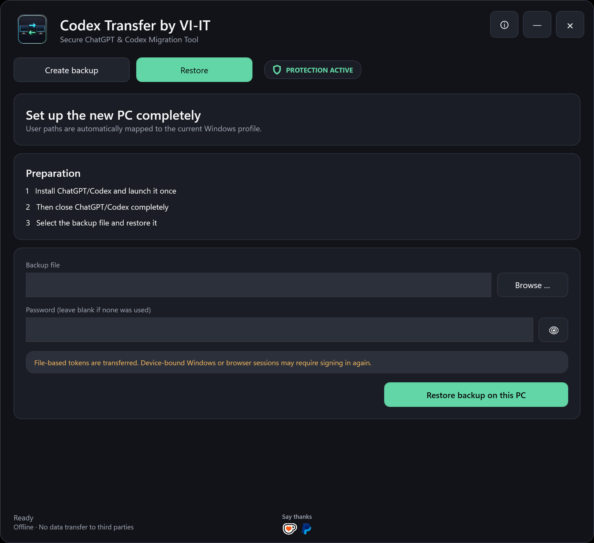
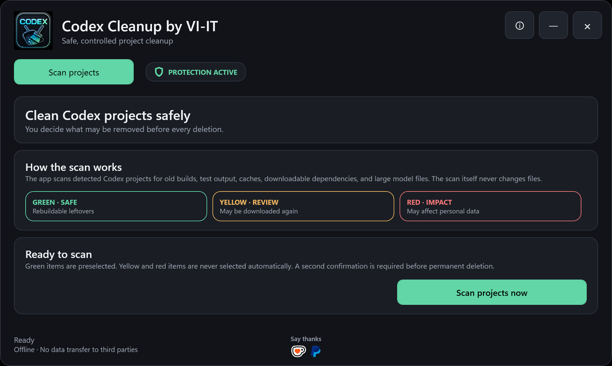
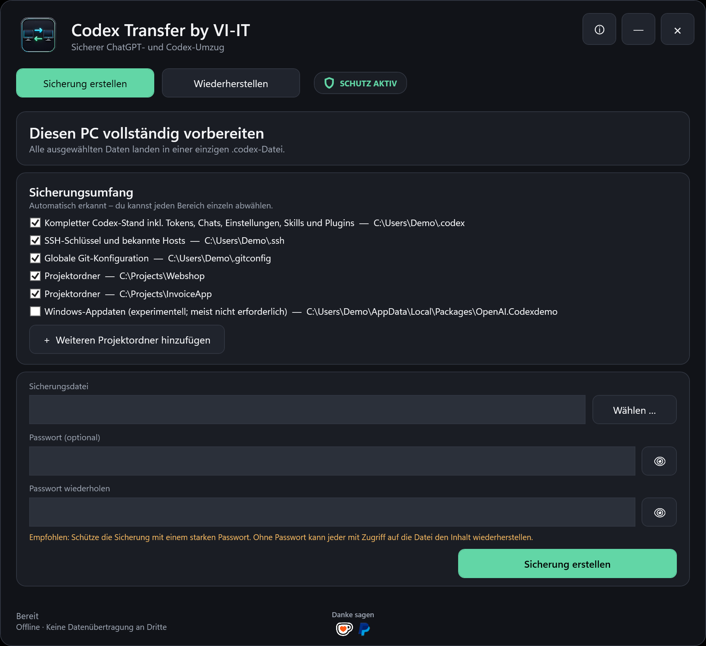
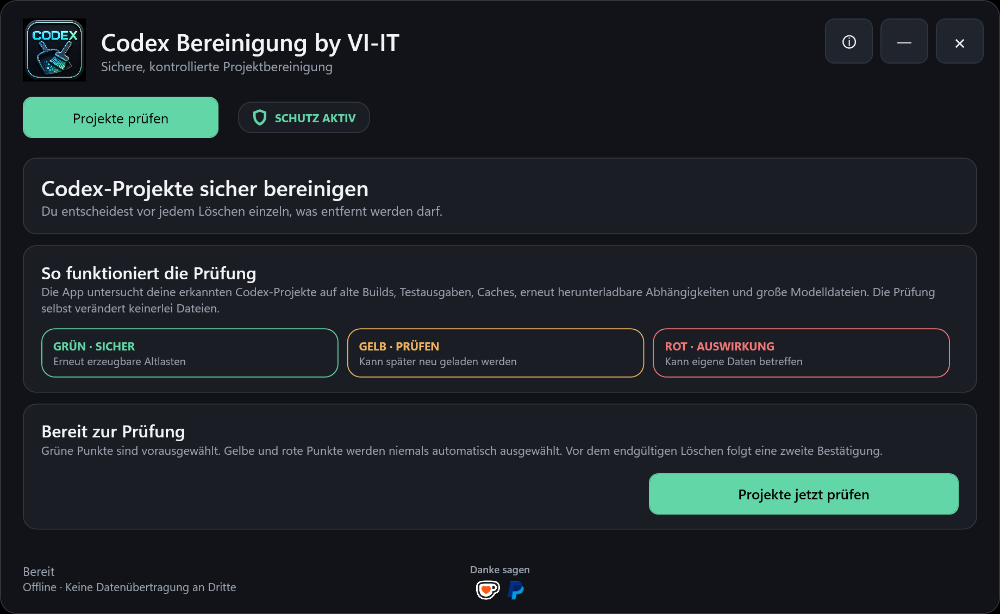
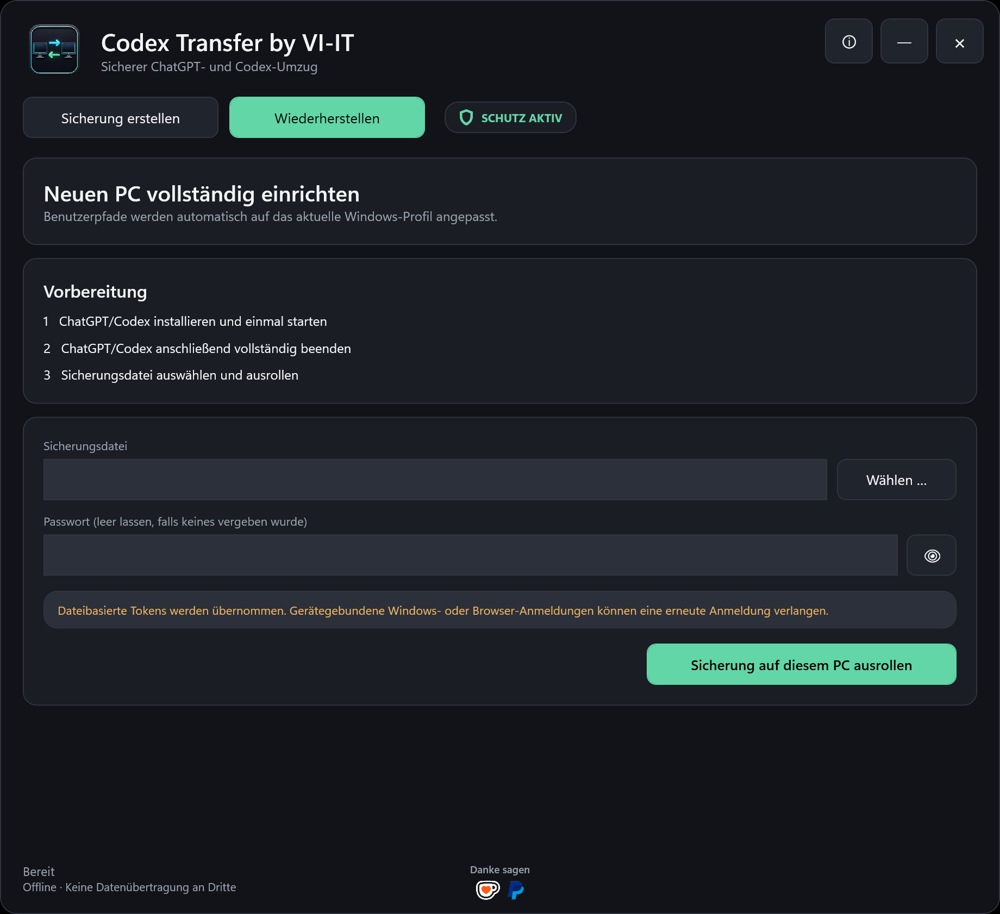

# Codex Transfer by VI-IT

**Portable Windows tool to securely back up and migrate a local Codex workspace to a new PC.**

[English](#english) · **[Deutsche Anleitung](#deutsch)** · [Download](https://github.com/VI-IT/Codex-Transfer/releases/latest) · [Privacy](PRIVACY.md) · [Security](SECURITY.md) · [Support](SUPPORT.md)

| Support development |
| --- |
| [ **Ko-fi**](https://ko-fi.com/viitde) &nbsp;&nbsp; [ **PayPal**](https://paypal.me/viitde) |

---

## English

Codex Transfer by VI-IT is a free, portable Windows backup and migration utility for moving a local OpenAI Codex setup from one computer to another. It discovers the local Codex home, project folders, settings, sessions, skills and plugins and stores the selected data in one `.codex` backup file. During restore, old Windows user-profile paths are mapped to the profile on the new PC. Before backup, version 1.0.1 can optionally scan selected projects for old builds, caches, test output, downloadable dependencies and AI models.

### Download for Windows

**[Download Codex Transfer by VI-IT](https://github.com/VI-IT/Codex-Transfer/releases/latest/download/Codex-Transfer-by-VI-IT.exe)**

- Windows 10 or Windows 11, x64
- One self-contained portable EXE; no installation and no separate .NET runtime required
- German automatically on German Windows; English on other Windows display languages
- Checks the official GitHub release channel at startup and notifies you about newer versions

> The executable is currently not Authenticode-signed. Windows SmartScreen may display an unknown-publisher warning. Download only from this official repository and compare the published SHA-256 checksum.

### What Codex Transfer can migrate

- Complete local `CODEX_HOME`, normally `%USERPROFILE%\.codex`
- Local Codex sessions, chats, configuration, state databases, skills and plugins
- File-based authentication material such as `auth.json`, when present
- Automatically detected or manually selected project folders
- Optional SSH keys and known hosts from `%USERPROFILE%\.ssh`
- Optional global Git configuration from `%USERPROFILE%\.gitconfig`
- Optional experimental Windows Codex app-package data
- Text-based references to the previous Windows user profile in supported configuration and Git files
- Optional project cleanup review before backup with green, yellow and red risk levels

Device-bound Windows Credential Manager entries, browser sessions and cloud-managed ChatGPT account data cannot be guaranteed to move. Signing in again may be required. Cloud ChatGPT conversations, memories, custom GPTs and subscription settings belong to the ChatGPT account and are not recreated from the local `.codex` archive.

### Move Codex to a new PC

1. Close ChatGPT and Codex completely on the old PC.
2. Start `Codex-Transfer-by-VI-IT.exe` and select the data and projects to include.
3. Choose a `.codex` backup file. A password is optional, but a strong password is recommended.
4. Copy the portable EXE and the `.codex` file to the new computer.
5. Install and launch ChatGPT/Codex once on the new PC, then close it completely.
6. Open Codex Transfer, choose **Restore**, select the backup and restore it.

### Review project leftovers before backup

Before creating the archive, Codex Transfer can scan the selected projects for rebuildable output, old test runs, caches, superseded builds, downloadable dependencies and AI model files. Green findings are rebuildable and preselected. Yellow and red findings are never selected automatically. Every permanent deletion requires a second confirmation.

The same scanner is also available as the independent portable [Codex Cleanup by VI-IT](https://github.com/VI-IT/Codex-Cleanup).

### Privacy and security

- Backup contents are processed locally and are never uploaded to VI-IT
- No analytics, advertising, tracking or VI-IT cloud service
- One `.codex` archive with optional password protection
- Password-protected archives use AES-256-CBC, HMAC-SHA-256 and PBKDF2-SHA-256
- Integrity verification rejects a wrong password or modified archive
- Only release metadata is requested from GitHub when checking for updates

Without a password, the archive is not effectively protected from anyone who can access it. A backup can contain conversations, code, credentials and SSH keys. Keep it private and never upload it to an issue, chat or public repository.

Read the complete [privacy information](PRIVACY.md) and [security policy](SECURITY.md).

> **Liability notice:** Use is entirely at your own risk. Review every selected path and keep a current backup. To the extent permitted by law, VI-IT accepts no liability for data loss, downtime, damage or consequential loss.

### Support development

[Say thanks via Ko-fi](https://ko-fi.com/viitde) · [Support via PayPal](https://paypal.me/viitde)

Support is voluntary and does not unlock features.

---

## Deutsch

Codex Transfer by VI-IT ist ein kostenloses, portables Windows-Programm zum sicheren Sichern und Übertragen eines lokalen OpenAI-Codex-Arbeitsplatzes auf einen neuen PC. Es erkennt den lokalen Codex-Ordner, Projektordner, Einstellungen, Sitzungen, Skills und Plugins und speichert die ausgewählten Daten in einer einzigen `.codex`-Sicherungsdatei. Bei der Wiederherstellung werden alte Windows-Benutzerpfade auf das Profil des neuen PCs angepasst. Version 1.0.1 kann ausgewählte Projekte vor der Sicherung zusätzlich auf alte Builds, Caches, Testausgaben, erneut herunterladbare Abhängigkeiten und KI-Modelle prüfen.

### Download für Windows

**[Codex Transfer by VI-IT herunterladen](https://github.com/VI-IT/Codex-Transfer/releases/latest/download/Codex-Transfer-by-VI-IT.exe)**

- Windows 10 oder Windows 11, x64
- Eine vollständige portable EXE; keine Installation und keine separate .NET-Laufzeit erforderlich
- Unter deutschem Windows automatisch Deutsch, bei anderen Windows-Anzeigesprachen Englisch
- Prüft beim Start den offiziellen GitHub-Releasekanal und weist auf neuere Versionen hin

> Die EXE ist derzeit nicht mit einem Authenticode-Zertifikat signiert. Windows SmartScreen kann deshalb einen Hinweis auf einen unbekannten Herausgeber anzeigen. Lade sie ausschließlich aus diesem offiziellen Repository herunter und vergleiche die veröffentlichte SHA-256-Prüfsumme.

### Was Codex Transfer übertragen kann

- Komplettes lokales `CODEX_HOME`, normalerweise `%USERPROFILE%\.codex`
- Lokale Codex-Sitzungen, Chats, Konfiguration, Zustandsdatenbanken, Skills und Plugins
- Dateibasierte Authentifizierungsdaten wie `auth.json`, sofern vorhanden
- Automatisch erkannte oder manuell ausgewählte Projektordner
- Optional SSH-Schlüssel und bekannte Hosts aus `%USERPROFILE%\.ssh`
- Optional die globale Git-Konfiguration aus `%USERPROFILE%\.gitconfig`
- Optional experimentelle Windows-Codex-Appdaten
- Textbasierte Verweise auf das frühere Windows-Benutzerprofil in unterstützten Konfigurations- und Git-Dateien
- Optionale Projektbereinigung vor der Sicherung mit grünen, gelben und roten Risikostufen

Gerätegebundene Einträge des Windows Credential Managers, Browsersitzungen und cloudverwaltete ChatGPT-Kontodaten können nicht garantiert übertragen werden. Eine erneute Anmeldung kann erforderlich sein. ChatGPT-Cloudunterhaltungen, Memories, eigene GPTs und Abonnementdaten gehören zum ChatGPT-Konto und werden nicht aus der lokalen `.codex`-Datei neu angelegt.

### Codex auf einen neuen PC umziehen

1. ChatGPT und Codex auf dem alten PC vollständig beenden.
2. `Codex-Transfer-by-VI-IT.exe` starten und die gewünschten Daten und Projekte auswählen.
3. Eine `.codex`-Sicherungsdatei wählen. Ein Passwort ist optional, wird aber dringend empfohlen.
4. Portable EXE und `.codex`-Datei auf den neuen Rechner kopieren.
5. ChatGPT/Codex auf dem neuen PC installieren, einmal starten und wieder vollständig beenden.
6. Codex Transfer öffnen, **Wiederherstellen** wählen und die Sicherung ausrollen.

### Projekt-Altlasten vor der Sicherung prüfen

Vor dem Erstellen des Archivs kann Codex Transfer die ausgewählten Projekte auf reproduzierbare Buildausgaben, alte Testläufe, Caches, ersetzte Builds, erneut herunterladbare Abhängigkeiten und KI-Modelle prüfen. Grüne Funde sind reproduzierbar und vorausgewählt. Gelbe und rote Funde werden niemals automatisch ausgewählt. Vor jeder endgültigen Löschung folgt eine zweite Bestätigung.

Dieselbe Prüfung gibt es auch als eigenständige portable App [Codex Bereinigung by VI-IT](https://github.com/VI-IT/Codex-Cleanup).

### Datenschutz und Sicherheit

- Sicherungsinhalte werden lokal verarbeitet und niemals an VI-IT übertragen
- Keine Analysefunktionen, Werbung, Nachverfolgung oder VI-IT-Cloud
- Eine `.codex`-Datei mit optionalem Passwortschutz
- Passwortgeschützte Archive verwenden AES-256-CBC, HMAC-SHA-256 und PBKDF2-SHA-256
- Integritätsprüfung weist ein falsches Passwort oder eine veränderte Datei zurück
- Bei der Updateprüfung werden ausschließlich Release-Metadaten von GitHub abgerufen

Ohne Passwort ist das Archiv nicht wirksam vor Personen geschützt, die Zugriff auf die Datei haben. Eine Sicherung kann Unterhaltungen, Quellcode, Zugangsdaten und SSH-Schlüssel enthalten. Bewahre sie vertraulich auf und lade sie niemals in ein Issue, einen Chat oder ein öffentliches Repository hoch.

Lies die vollständigen [Datenschutzinformationen](PRIVACY.md) und die [Sicherheitsrichtlinie](SECURITY.md).

> **Haftungsausschluss:** Die Nutzung erfolgt vollständig auf eigene Verantwortung. Prüfe jeden ausgewählten Pfad und erstelle eine aktuelle Sicherung. Soweit gesetzlich zulässig, übernimmt VI-IT keinerlei Haftung für Datenverlust, Ausfallzeiten, Schäden oder Folgeschäden.

### Entwicklung unterstützen

[Über Ko-fi Danke sagen](https://ko-fi.com/viitde) · [Mit PayPal unterstützen](https://paypal.me/viitde)

Die Unterstützung ist freiwillig und schaltet keine zusätzlichen Funktionen frei.

---

## Contact / Kontakt

- Website: [www.vi-it.de](https://www.vi-it.de)
- Email: [info@vi-it.de](mailto:info@vi-it.de)
- Issues: [GitHub Issues](https://github.com/VI-IT/Codex-Transfer/issues)

Codex Transfer by VI-IT is distributed as closed-source Windows software. Source code is not included in this public release repository.

ChatGPT, Codex and OpenAI are trademarks of OpenAI. Codex Transfer by VI-IT is independent software and is not affiliated with, sponsored, certified, or endorsed by OpenAI.

ChatGPT, Codex und OpenAI sind Marken von OpenAI. Codex Transfer by VI-IT ist unabhängige Software und nicht mit OpenAI verbunden, von OpenAI gesponsert, zertifiziert oder empfohlen.

